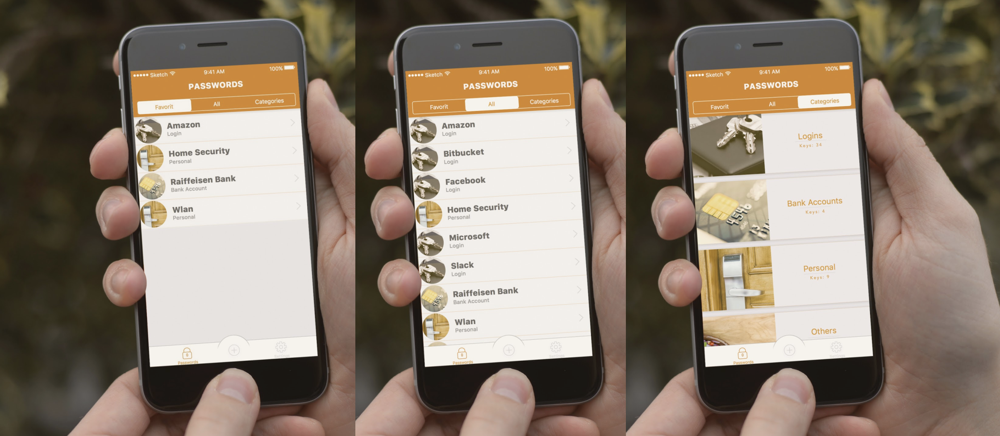
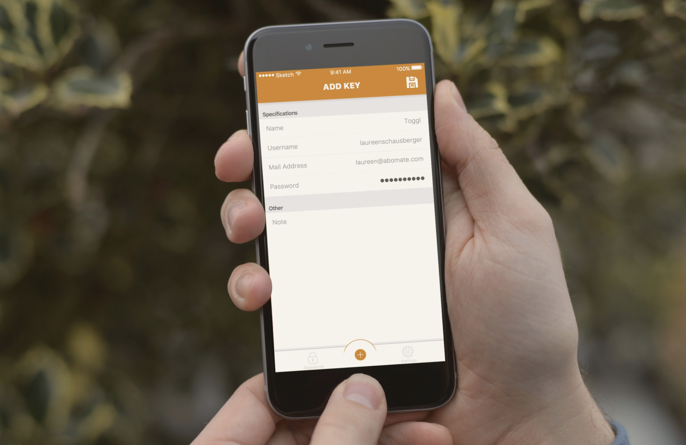
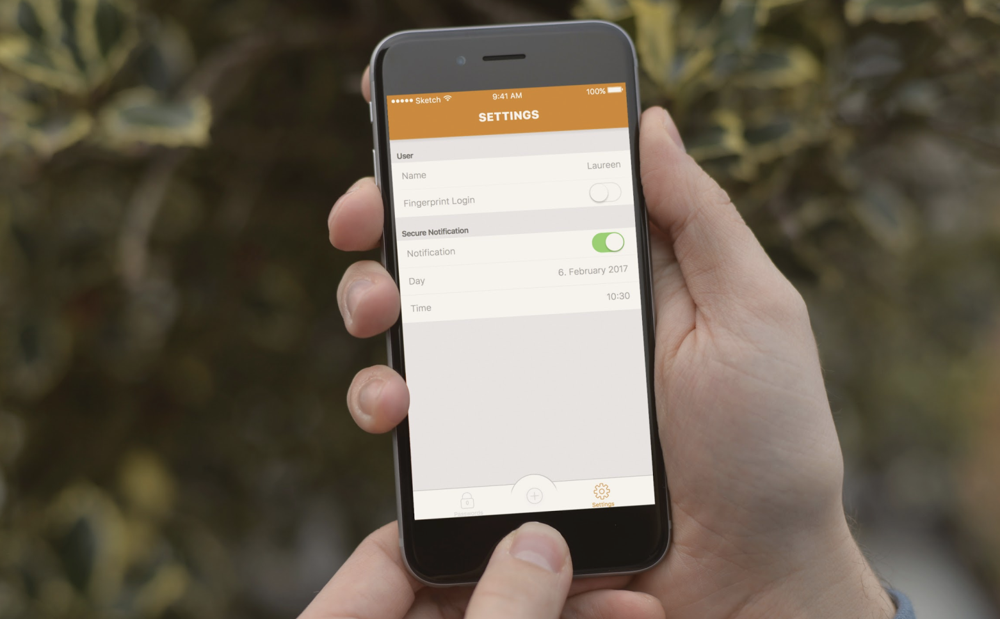

# keymate
This is an iOS project for the module "Software Egnineering under iOS" for the BSc degree Mobile Computing at the University of Applied Sciences Upper Austria.

## Vision
Keymate is your own and personal password/key-manager, in which you can store all your login or bank data, or simply some other personal but important information.
Furthermore, you can store information as favorits to can access them more easily, and you can savely trigger a notification for sensible data which can only be read when you are inside your app, that is protected by finger print or master password identification.

## Results
Keymate was successfully implemented and tested on IPhone 6 and 7 in portrait and landscape mode and with various border cases.

The app has a login page, and three main tabs:

- Stored Keys
- Add
- Settings

### Stored Keys

This tab has a segment control with three segments: Favorites, All, and Categories. 
The Fav Container only shows passwords/keys that have previosuly been declared as special favorites by the user. 
The All Container shows all keys that have been stored, and the Categories Container shows the current active categorizes and filters all keys based on them. 

### Add
The Add Tab is allowing the user to easily add more keys to its database. 

### Settings
The Settings Tab allows the user to edit the settings, and trigger Secure Notifications to notify the user of private meetings/dates. 

